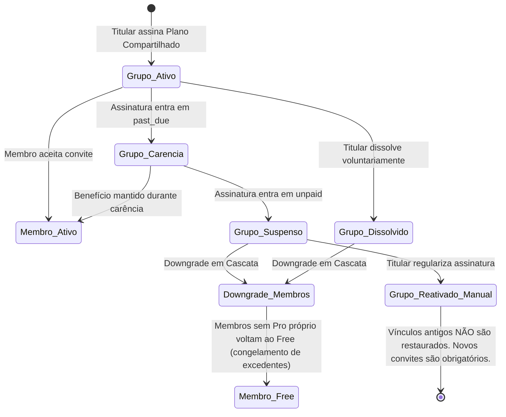

# Plano Técnico: Pacote 05.04 — Grupos Compartilhados e Isolamento Multitenant (ADR-004)

## 1. Visão Geral e Objetivo

O **Pacote 05.04** tem como objetivo implementar a infraestrutura completa de **Grupos de Assinatura Compartilhada** para o CarteiraExpert, vinculada a um **Plano Comercial Próprio e Separado do Plano Pro** (com identificador provisório `shared` ou `family`). O titular com assinatura elegível do plano compartilhado poderá convidar até 4 pessoas (**Membros**) para usufruírem dos entitlements definidos para o plano em suas próprias contas individuais, sob a garantia estrita e inegociável do [ADR-004 (docs/decisions/ADR-004-shared-plan-privacy.md)](file:///c:/Projetos/carteiraexpert/docs/decisions/ADR-004-shared-plan-privacy.md).

> **Princípio Mestre de Privacidade e Isolamento (ADR-004):**
> A assinatura compartilhada é estritamente um mecanismo comercial e administrativo de concessão de entitlements de software. O Titular e os Membros **não possuem permissão técnica para visualizar, editar, exportar ou inferir** dados de carteiras, ativos, lançamentos operacionais, saldos, extratos, notas fiscais, relatórios tributários, alertas ou estudos uns dos outros.

---

## 2. Decisões de Produto Aprovadas

1. **Plano Comercial Próprio e Separado:**
   - O plano compartilhado será uma **entidade comercial própria**, separada do Plano Pro individual, com identificador provisório `shared` ou `family` (a ser formalizado na implementação).
   - O Plano Pro individual **não é mais requisito nem permite** criar ou administrar grupos compartilhados.

2. **Capacidade do Grupo:**
   - Limite fixo de **1 Titular + até 4 Membros convidados** (capacidade total máxima de 5 pessoas).
   - O Titular ocupa obrigatoriamente 1 das 5 vagas do grupo.
   - Não haverá limite configurável nesta primeira versão.

3. **Elegibilidade e Papéis:**
   - **Criação e Gestão Administrativa:** Restrita exclusivamente a usuários que possuam uma **assinatura própria do plano compartilhado** em estado elegível (`active` ou `trialing`).
   - Usuários com Plano Free ou com Plano Pro individual não podem criar nem administrar grupos compartilhados.
   - **Membros Convidados:** Recebem os entitlements concedidos pelo plano compartilhado somente após o **aceite voluntário e válido** do convite.
   - O vínculo ao grupo não altera a titularidade, propriedade ou custódia das carteiras preexistentes dos membros.

4. **Preço e Condições Comerciais:**
   - O preço oficial do plano compartilhado **não está aprovado definitivamente**.
   - **Proibição Estrita de Valores Arbitrários:** O valor de R$ 99,99 **não deve ser registrado** como preço oficial no modelo de dados, no código ou na documentação.
   - A interface e os catálogos representarão o valor como **“Preço a definir”**, **“A definir”** ou indicação neutra equivalente.
   - Não serão criados descontos, ciclos fixados ou condições comerciais recorrentes nesta etapa.

5. **Origem da Assinatura e Proteção Contratual:**
   - O titular é a única origem da assinatura comercial do grupo (`billing_subscriptions`).
   - Os membros convidados **não podem alterar, cancelar, pausar ou migrar** a assinatura do titular.
   - Os membros recebem apenas os entitlements de software atribuídos ao plano compartilhado.

6. **Superfície de Interface:**
   - A gestão do grupo será integrada **exclusivamente dentro da página `/plans`**.
   - Não será criada uma rota `/settings/group` separada nesta etapa.
   - A interface exibirá estritamente metadados administrativos (Nome do grupo, Vagas ocupadas/disponíveis, Lista de membros convidados com papel, status do convite e data, e Ações administrativas de convidar, reenviar, revogar, remover, sair ou dissolver).
   - **Vedação Absoluta de Dados Financeiros:** A interface nunca exibirá patrimônio, saldos, quantidade de carteiras criadas ou links de acesso aos investimentos de outros membros.

7. **Saída do Titular e Dissolução do Grupo:**
   - A titularidade **não é transferível** nesta primeira versão. Não haverá operação comum de transferência.
   - Caso o titular cancele a assinatura ou decida dissolver o grupo, o grupo será **dissolvido** (`status = 'cancelled'`).
   - Os membros perderão imediatamente o benefício compartilhado e serão rebaixados transacionalmente ao Plano Free via `applyPlanDowngradeInTransaction`.
   - Carteiras excedentes dos membros serão congeladas (`status = 'frozen'`) sem exclusão de dados financeiros históricos.
   - A dissolução será idempotente e auditada em `audit_logs`.

8. **Reativação após Suspensão ou Inadimplência:**
   - **A reativação é estritamente MANUAL:** Mesmo que o titular regularize sua assinatura compartilhada após inadimplência (`unpaid`), o sistema **não restaurará automaticamente os membros**.
   - Os vínculos anteriores não voltam a conceder benefícios automaticamente.
   - O titular deverá gerar e enviar novos convites, e os membros deverão aceitá-los formalmente, respeitando o limite máximo de 5 pessoas.
   - Essa regra elimina riscos de replay, duplicidade e concessão indevida de entitlements.

9. **Reenvio de Convites e Rate Limiting:**
   - O reenvio é permitido **somente para convites em status `pending` ou `expired`**.
   - Não é permitido reenviar convites com status `accepted`, `declined`, `revoked` ou `removed`.
   - **Limite Máximo de 5 envios/reenvios por hora por titular** (rate limiting server-side auditado).
   - Ao reenviar, gera-se um **novo token criptográfico**, o token anterior é invalidado (`status = 'revoked'`) e persiste-se apenas o hash SHA-256 do novo token.
   - Mensagens de erro nunca revelarão se um e-mail já possui conta ativa na plataforma.

10. **Entrega de Convites sem Integração SMTP:**
    - **Não haverá envio automático de e-mails nesta fase.**
    - O sistema gera um link de convite contendo token criptográfico de alta entropia.
    - O token em texto puro é **exibido ao titular UMA ÚNICA VEZ** em modal seguro imediatamente após a criação/reenvio, com botão para cópia manual.
    - O token **nunca é persistido em texto puro** no banco (armazena-se apenas seu hash SHA-256).
    - O token **não poderá ser visualizado novamente** após o fechamento do modal.
    - A interface esclarecerá explicitamente que o titular é o único responsável por transmitir o link ao convidado.
    - Uma futura integração SMTP ou serviço de mensageria exigirá homologação e análise de segurança separada.

11. **Regras de Aceite e Consumo de Convites:**
    - Expiração padrão de **7 dias corridos** (`expiresAt = now() + 7 days`).
    - Aceite restrito a usuário autenticado cujo e-mail cadastrado em `users.email` corresponda exatamente ao `invited_email` registrado.
    - Consumo transacional com **lock pessimista (`FOR UPDATE`)** na linha do grupo e do convite, impedindo que requisições concorrentes ultrapassem o teto de 5 integrantes.
    - Proteção estrita contra replay e suporte formal a recusa (`declined`), revogação (`revoked`) e expiração (`expired`).

12. **Isolamento Financeiro Obrigatório:**
    - Nenhum `JOIN` entre tabelas de grupos e tabelas financeiras (`portfolios`, `portfolio_events`, `assets`).
    - Nenhuma carteira receberá coluna `group_id` para compartilhamento financeiro.
    - Nenhum `userId` enviado pelo cliente poderá definir ownership de recursos.
    - Toda consulta financeira continuará filtrando exclusivamente pelo usuário autenticado derivado da sessão do servidor (`getCurrentUser()`).

---

## 3. Matriz de Precedência de Planos e Entitlements

A resolução do plano e dos limites efetivos de um usuário (`getUserEffectivePlan`) seguirá a seguinte ordem estrita e determinística:

```text
┌─────────────────────────────────────────────────────────────────────────────┐
│                       MATRIZ DE PRECEDÊNCIA (DETERMINÍSTICA)                 │
├─────────────────────────────────────────────────────────────────────────────┤
│ 1. Assinatura Pro Individual Própria Ativa/Trialing                         │
│    -> PREVALECE sobre qualquer benefício compartilhado de grupo.            │
│    -> O usuário utiliza sua assinatura individual Pro.                     │
├─────────────────────────────────────────────────────────────────────────────┤
│ 2. Assinatura Própria do Plano Compartilhado (Titular)                     │
│    -> Concede entitlements do plano compartilhado e gestão do grupo.        │
├─────────────────────────────────────────────────────────────────────────────┤
│ 3. Benefício Ativo de Membro em Grupo Compartilhado Elegível                │
│    -> Utilizado se o membro NÃO possuir assinatura Pro própria.             │
│    -> Concede os entitlements do plano compartilhado enquanto ativo.        │
├─────────────────────────────────────────────────────────────────────────────┤
│ 4. Registro Direto Vigente em user_plans (Legado/Cortesia)                  │
│    -> Concede o plano específico registrado em user_plans.                  │
├─────────────────────────────────────────────────────────────────────────────┤
│ 5. Fallback Padrão                                                          │
│    -> Plano Free.                                                           │
└─────────────────────────────────────────────────────────────────────────────┘
```

### Regras de Precedência e Coexistência:
1. **Assinatura Própria Prevalece:** Se um usuário com assinatura Pro individual ativa aceitar um convite de grupo, sua assinatura Pro própria permanece como fonte primária de entitlements. O benefício do grupo não altera nem cancela sua assinatura própria.
2. **Ausência de Duplicação de Quotas:** Nunca haverá soma ou concessão cumulativa de quotas de fontes diferentes.
3. **Término do Vínculo de Grupo:** Se o benefício compartilhado for encerrado (por saída, remoção ou dissolução do grupo) e o usuário não possuir assinatura própria elegível, aplica-se o downgrade transacional imediato para o **Plano Free**.

---

## 4. Quotas dos Participantes

1. **Quota Individual e Integral:**
   - O plano técnico estabelece que a quota é **estritamente individual por usuário**.
   - **Não haverá pool compartilhado:** Não existe contagem global de carteiras nem divisão de saldo de carteiras entre os participantes. O uso da quota de um membro não consome o limite dos demais.
   - O Titular e cada Membro consomem quotas totalmente separadas.
   - As carteiras de todos os participantes permanecem 100% isoladas.
2. **Definição Numérica da Quota do Plano Compartilhado (Decisão Pendente):**
   - O limite numérico de carteiras ativas para o plano compartilhado (`max_active_portfolios`) não será inventado nesta etapa.
   - Fica registrado como **decisão de produto pendente** se cada participante receberá:
     - *Opção A:* A mesma quota individual do Plano Pro (10 carteiras ativas);
     - *Opção B:* Uma quota própria específica definida no catálogo para o plano compartilhado;
     - *Opção C:* Outra regra comercial aprovada posteriormente.

---

## 5. Modelo de Dados Proposto e Avaliação Estrutural

### 5.1. Avaliação Crítica: Modelo de 2 Tabelas vs. Modelo de 3 Tabelas

| Critério Técnico | Opção A: 2 Tabelas (`billing_groups` + `billing_group_members`) | Opção B: 3 Tabelas (`billing_groups` + `billing_group_members` + `billing_group_invitations`) *(RECOMENDADA)* |
|---|---|---|
| **Segregação de Conceitos** | Mistura convites efêmeros (baseados em e-mail e token) com vínculos de identidade permanente (`user_id`). | Segregação estrita entre o ciclo de vida do convite (e-mail + hash) e a filiação de membros autenticados (`user_id`). |
| **Reenvio e Ciclo de Vida** | Reenviar convite exige sobrescrever campos ou tolerar registros com `user_id = NULL` e estados ambíguos. | Reenviar convite revoga o registro anterior de forma auditável e cria uma nova entidade limpa com novo hash e novo TTL. |
| **Segurança e Minimização** | Hashes de tokens efêmeros poluem a tabela de membros indefinidamente. | Hashes de tokens ficam restritos à tabela de convites, permitindo expiração e purga periódica segura. |
| **Integridade Relacional** | `user_id` precisaria ser `NULLABLE` em `billing_group_members` enquanto o convite estiver pendente. | `billing_group_members.user_id` é `NOT NULL` com integridade referencial estrita (`REFERENCES users(id)`). |

> **Decisão Arquitetural Homologada:** **Adotar o Modelo de 3 Tabelas (Opção B)**. Ele oferece tipagem estrita, integridade relacional sem nulabilidade ambígua e isolamento de segurança de tokens.
>
> *Avaliação de Tabela de Histórico Adicional:* Não é necessária uma 4ª tabela. A tabela mestre de auditoria `audit_logs` já existente no CarteiraExpert registra de forma imutável todos os eventos, atores, deltas e snapshots de transições administrativas.

---

### 5.2. Estrutura de Schemas Drizzle Proposta (`src/lib/db/schema/groups.ts`)

```typescript
import { sql } from 'drizzle-orm';
import {
  pgTable,
  text,
  timestamp,
  uuid,
  integer,
  check,
  uniqueIndex,
  index,
} from 'drizzle-orm/pg-core';
import { users } from './identity';
import { commercialPlans } from './plans';
import { billingSubscriptions } from './billing';

// ─── 1. billing_groups ────────────────────────────────────────────────────────
// Entidade raiz do grupo compartilhado vinculado à assinatura do titular pagante.
export const billingGroups = pgTable(
  'billing_groups',
  {
    id: uuid('id').primaryKey(),
    ownerUserId: uuid('owner_user_id')
      .notNull()
      .unique('uq_billing_groups_owner_user_id')
      .references(() => users.id, { onDelete: 'restrict' }),
    // Vínculo com a assinatura comercial própria do plano compartilhado
    subscriptionId: uuid('subscription_id')
      .references(() => billingSubscriptions.id, { onDelete: 'set null' }),
    planId: text('plan_id')
      .notNull()
      .references(() => commercialPlans.id, { onDelete: 'restrict' }),
    name: text('name').notNull(),
    maxMembers: integer('max_members').notNull().default(5),
    // 'active' | 'suspended' | 'cancelled'
    status: text('status').notNull().default('active'),
    createdAt: timestamp('created_at', { withTimezone: true }).notNull().defaultNow(),
    updatedAt: timestamp('updated_at', { withTimezone: true }).notNull().defaultNow(),
  },
  (table) => [
    check('chk_billing_groups_max_members', sql`${table.maxMembers} = 5`),
    check('chk_billing_groups_status', sql`${table.status} IN ('active', 'suspended', 'cancelled')`),
    index('idx_billing_groups_owner_user_id').on(table.ownerUserId),
    index('idx_billing_groups_subscription_id').on(table.subscriptionId),
  ]
);

// ─── 2. billing_group_members ──────────────────────────────────────────────────
// Membros ativos e históricos associados ao grupo.
export const billingGroupMembers = pgTable(
  'billing_group_members',
  {
    id: uuid('id').primaryKey(),
    groupId: uuid('group_id')
      .notNull()
      .references(() => billingGroups.id, { onDelete: 'cascade' }),
    userId: uuid('user_id')
      .notNull()
      .references(() => users.id, { onDelete: 'restrict' }),
    // 'owner' | 'member'
    role: text('role').notNull().default('member'),
    // 'active' | 'inactive'
    status: text('status').notNull().default('active'),
    joinedAt: timestamp('joined_at', { withTimezone: true }).notNull().defaultNow(),
    leftAt: timestamp('left_at', { withTimezone: true }),
    // 'voluntary' | 'removed_by_owner' | 'group_suspended' | 'owner_downgraded' | 'group_dissolved'
    leftReason: text('left_reason'),
    createdAt: timestamp('created_at', { withTimezone: true }).notNull().defaultNow(),
    updatedAt: timestamp('updated_at', { withTimezone: true }).notNull().defaultNow(),
  },
  (table) => [
    check('chk_group_members_role', sql`${table.role} IN ('owner', 'member')`),
    check('chk_group_members_status', sql`${table.status} IN ('active', 'inactive')`),
    // Impede que um mesmo usuário pertença a mais de um grupo ativo simultaneamente
    uniqueIndex('uq_active_user_group_membership')
      .on(table.userId)
      .where(sql`${table.status} = 'active'`),
    index('idx_group_members_group_id').on(table.groupId),
    index('idx_group_members_user_id').on(table.userId),
  ]
);

// ─── 3. billing_group_invitations ──────────────────────────────────────────────
// Ciclo de vida efêmero e rastreável de convites emitidos para e-mails.
export const billingGroupInvitations = pgTable(
  'billing_group_invitations',
  {
    id: uuid('id').primaryKey(),
    groupId: uuid('group_id')
      .notNull()
      .references(() => billingGroups.id, { onDelete: 'cascade' }),
    invitedByUserId: uuid('invited_by_user_id')
      .notNull()
      .references(() => users.id, { onDelete: 'restrict' }),
    invitedEmail: text('invited_email').notNull(),
    // Armazena exclusivamente o hash SHA-256 do token
    tokenHash: text('token_hash').notNull().unique('uq_group_invitations_token_hash'),
    // 'pending' | 'accepted' | 'declined' | 'revoked' | 'expired'
    status: text('status').notNull().default('pending'),
    expiresAt: timestamp('expires_at', { withTimezone: true }).notNull(),
    acceptedByUserId: uuid('accepted_by_user_id')
      .references(() => users.id, { onDelete: 'restrict' }),
    acceptedAt: timestamp('accepted_at', { withTimezone: true }),
    revokedAt: timestamp('revoked_at', { withTimezone: true }),
    createdAt: timestamp('created_at', { withTimezone: true }).notNull().defaultNow(),
    updatedAt: timestamp('updated_at', { withTimezone: true }).notNull().defaultNow(),
  },
  (table) => [
    check('chk_group_invitations_status', sql`${table.status} IN ('pending', 'accepted', 'declined', 'revoked', 'expired')`),
    // Garante que não haja múltiplos convites pendentes para o mesmo e-mail no mesmo grupo
    uniqueIndex('uq_pending_group_invite_email')
      .on(table.groupId, table.invitedEmail)
      .where(sql`${table.status} = 'pending'`),
    index('idx_group_invitations_group_id').on(table.groupId),
    index('idx_group_invitations_invited_email').on(table.invitedEmail),
    index('idx_group_invitations_token_hash').on(table.tokenHash),
  ]
);
```

---

## 6. Gestão de Convites, Segurança e Rate Limiting

1. **Geração e Armazenamento de Tokens:**
   - Token gerado com 256 bits de entropia: `crypto.randomBytes(32).toString('hex')`.
   - Armazenamento no PostgreSQL restrito ao hash criptográfico SHA-256.
   - O token em texto puro trafega apenas na resposta síncrona da Server Action e **nunca é persistido ou logado**.
2. **Exibição Única e Cópia Manual:**
   - Após criar ou reenviar convite, a interface `/plans` renderiza um modal com o link: `https://app.carteiraexpert.com.br/plans?invite=<token>`.
   - O modal instrui claramente: *"Copie este link e envie ao convidado. Por motivos de segurança, o link não poderá ser exibido novamente após fechar esta janela."*
3. **Controle de Taxa (Rate Limit):**
   - Limite estrito de **5 envios/reenvios de convites por hora por titular**.
   - Verificação baseada na contagem de `billing_group_invitations.created_at >= now() - 1 hour`.
   - Exceder o limite resulta em rejeição com erro `GroupInviteRateLimitExceededError`.
4. **Reenvio de Convites:**
   - Permitido apenas quando o status atual for `pending` ou `expired`.
   - O reenvio altera o convite anterior para `revoked` (com timestamp `revokedAt`) e insere um novo registro com novo hash de token e validade de mais 7 dias.
5. **Consumo Atômico sob Lock Concorrente:**
   - No aceite, inicia-se transação com `FOR UPDATE` na linha do `billing_groups`.
   - Contam-se os membros ativos (`status = 'active'`). Se `COUNT >= 5`, a transação é abortada com `GroupCapacityExceededError`.
   - Valida-se se o e-mail do usuário autenticado coincide com `billing_group_invitations.invited_email`.
   - Atualiza-se o convite para `accepted` e cria-se o registro em `billing_group_members`.

---

## 7. Matriz de Permissões e Autorização Server-Side

| Ação do Domínio | Titular com Plano Compartilhado Elegível | Membro Convidado (`member`) | Usuário com Pro Individual | Usuário Free |
|---|---|---|---|---|
| **Criar Grupo** | Permitido | Negado | Negado | Negado |
| **Convidar Membro** | Permitido (até 5 vagas e 5 envios/h) | Negado | Negado | Negado |
| **Reenviar Convite** | Permitido (somente `pending`/`expired`) | Negado | Negado | Negado |
| **Revogar Convite** | Permitido (somente `pending`) | Negado | Negado | Negado |
| **Remover Membro** | Permitido | Negado | Negado | Negado |
| **Sair do Grupo** | Negado (deve dissolver o grupo) | Permitido a qualquer momento | N/A | N/A |
| **Dissolver Grupo** | Permitido | Negado | Negado | Negado |
| **Aceitar / Recusar Convite** | N/A | Permitido (se e-mail coincidir) | Permitido (se e-mail coincidir) | Permitido (se e-mail coincidir) |
| **Consultar Carteiras de Outros Membros** | **NUNCA (Vedação ADR-004)** | **NUNCA (Vedação ADR-004)** | **NUNCA** | **NUNCA** |
| **Alterar Assinatura do Titular** | Permitido | **NUNCA** | **NUNCA** | **NUNCA** |

- **Todas as permissões são validadas no servidor** a partir da sessão ativa (`getCurrentUser()`). Nenhum identificador vindo do cliente é utilizado para determinar papéis ou propriedade.

---

## 8. Isolamento Financeiro e Prevenção contra IDOR

1. **Consultas Segregadas de Carteiras:**
   - As consultas em `src/modules/portfolio/` continuam com a cláusula obrigatória `WHERE portfolios.user_id = currentUser.id`.
   - Nenhuma tabela de grupos possui relacionamentos diretos com `portfolios`, `portfolio_events` ou `assets`.
   - Nenhuma carteira receberá coluna de grupo.
2. **Resistência a IDOR:**
   - Tentativa de acessar carteira de outro usuário retorna `PortfolioNotFoundError` (HTTP 404), sem vazar dados ou existência.
3. **Resistência à Enumeração de E-mails:**
   - Mensagens de erro informativas padronizadas sem revelar o status cadastral de terceiros.

---

## 9. Relação com Billing e Ciclo de Vida da Assinatura



- **Período de Carência (`past_due`):** O benefício dos membros é mantido temporariamente até o encerramento da carência configurada para o titular. Novos convites continuam sujeitos às regras de limite e carência.
- **Inadimplência (`unpaid`) ou Cancelamento Imediato:** Executa `applyGroupSuspensionInTransaction(groupId, reason, executor)`:
  1. Marca `billing_groups.status = 'suspended'` (ou `'cancelled'`).
  2. Marca membros ativos como `status = 'inactive'`, `left_reason = reason`, `left_at = now()`.
  3. Dispara `applyPlanDowngradeInTransaction(memberUserId)` para membros que não possuam assinatura Pro própria, congelando carteiras excedentes (`status = 'frozen'`).
- **Cancelamento ao Final do Período (`cancel_at_period_end = true`):** O grupo e os benefícios permanecem ativos até a data final do ciclo contratado (`current_period_end`). Ao término, o grupo é suspenso/dissolvido e os benefícios revogados.

---

## 10. Migração Versionada e Schema Guardian

- **Arquivo de Migração:** `drizzle/migrations/0009_add_shared_billing_groups.sql`.
- **Evolução do Schema Guardian:** A contagem oficial de tabelas físicas inspecionadas passará de **19 para 22 tabelas**:
  - `billing_groups` (Tabela 20)
  - `billing_group_members` (Tabela 21)
  - `billing_group_invitations` (Tabela 22)
- O script `scripts/verify-schema.ts` validará formalmente as 22 tabelas, suas colunas, tipos, constraints e índices parciais.

---

## 11. Serviços Server-Side (`src/modules/plans/server/group.service.ts`)

```typescript
// Assinaturas dos serviços de domínio com injeção de executor transacional
export async function createBillingGroup(ownerUser: SafeUser, groupName: string, executor?: DbExecutor): Promise<BillingGroup>;
export async function getBillingGroupForUser(userId: string, executor?: DbExecutor): Promise<BillingGroupOverview | null>;
export async function inviteGroupMember(ownerUser: SafeUser, email: string, executor?: DbExecutor): Promise<{ inviteId: string; inviteToken: string; expiresAt: Date }>;
export async function resendGroupInvitation(ownerUser: SafeUser, invitationId: string, executor?: DbExecutor): Promise<{ inviteId: string; newInviteToken: string; expiresAt: Date }>;
export async function revokeGroupInvitation(ownerUser: SafeUser, invitationId: string, executor?: DbExecutor): Promise<void>;
export async function acceptGroupInvitation(authenticatedUser: SafeUser, token: string, executor?: DbExecutor): Promise<void>;
export async function declineGroupInvitation(authenticatedUser: SafeUser, token: string, executor?: DbExecutor): Promise<void>;
export async function removeGroupMember(ownerUser: SafeUser, memberUserId: string, executor?: DbExecutor): Promise<void>;
export async function leaveBillingGroup(memberUser: SafeUser, executor?: DbExecutor): Promise<void>;
export async function dissolveBillingGroup(ownerUser: SafeUser, executor?: DbExecutor): Promise<void>;
export async function applyGroupSuspensionInTransaction(groupId: string, reason: string, executor: DatabaseTransaction): Promise<void>;
```

---

## 12. Server Actions Permitidas (`src/modules/plans/server/group.actions.ts`)

Todas as Server Actions serão protegidas por validação Zod, verificação de sessão (`getCurrentUser()`) e registro obrigatório em `audit_logs`:

1. `createBillingGroupAction({ name: string })`
2. `inviteGroupMemberAction({ email: string })`
3. `resendGroupInvitationAction({ invitationId: string })`
4. `revokeGroupInvitationAction({ invitationId: string })`
5. `acceptGroupInvitationAction({ token: string })`
6. `declineGroupInvitationAction({ token: string })`
7. `removeGroupMemberAction({ memberUserId: string })`
8. `leaveBillingGroupAction()`
9. `dissolveBillingGroupAction()`

---

## 13. Interface de Gestão em `/plans`

A página `src/modules/plans/ui/PlansView.tsx` será estendida com:

1. **Card Comercial do Plano Compartilhado:**
   - Título descritivo: *"Plano Compartilhado"* (ou identificador aprovado).
   - Preço: **“Preço a definir”** (com subtítulo explicativo de disponibilidade futura).
   - Ausência de botão que simule checkout ou contratação real.
   - Mensagem clara informando que a contratação automatizada estará disponível futuramente.
2. **Seção de Gestão do Grupo (Visão do Titular com Plano Compartilhado Elegível):**
   - Nome do grupo, badge *"Titular Pagante"*, contador de capacidade (ex: `3 de 5 vagas ocupadas`).
   - Tabela de Membros: Nome/E-mail mascarado, Papel, Status (`Ativo`, `Convite Pendente`, `Expirado`), Data e Ações (`Reenviar`, `Revogar`, `Remover`).
   - Formulário de Novo Convite com campo de e-mail e botão *"Gerar Convite"*.
   - Modal de Link Seguro exibido uma única vez com link copiável.
   - Botão de Dissolução com confirmação explícita sobre o rebaixamento dos membros.
3. **Visão do Membro Convidado:**
   - Card informativo: *"Você é membro do grupo de [Nome do Titular] e usufrui dos benefícios do Plano Compartilhado."*
   - Botão de ação voluntária: *"Deixar Grupo"*.
4. **Visão de Convite Pendente:**
   - Card de convite recebido com botões *"Aceitar Convite"* e *"Recusar"*.

---

## 14. Testes Obrigatórios

1. **Testes Unitários:**
   - Validações Zod para criação de grupo e convites por e-mail.
   - Máquina de estados de convites e resolução de precedência de plano efetivo.
   - Algoritmo de hash SHA-256 e validação de tokens de convite.
2. **Testes de Integração com PostgreSQL Real:**
   - Criação de grupo permitida para usuário com plano compartilhado ativo/trialing.
   - Bloqueio de criação para usuário Free e para usuário com Plano Pro individual (sem plano compartilhado).
   - Concorrência no preenchimento da 5ª vaga com lock pessimista `FOR UPDATE`.
   - Reenvio de convite: invalidação do token anterior e rate limiting de 5 envios/hora.
   - Precedência de assinatura Pro própria sobre benefício de grupo recebido.
   - Dissolução e inadimplência (`unpaid`): downgrade transacional dos membros e congelamento de carteiras excedentes.
   - Reativação manual: confirmação de que membros antigos não voltam automaticamente.
   - **Teste de Isolamento Financeiro (ADR-004):** Tentativa explícita do titular de consultar ou alterar carteiras de membros, comprovando retorno 404 e isolamento estrito.
3. **Testes End-to-End (Playwright):**
   - Fluxo completo em `/plans`: visualização do card do plano compartilhado com "Preço a definir"; Titular com plano compartilhado cria grupo, gera convite e copia link; Membro aceita convite e passa a usufruir dos entitlements; Titular consulta `/plans` e vê apenas metadados administrativos, sem dados financeiros do membro.

---

## 15. Riscos de Segurança e Mitigações

| Risco de Segurança / LGPD | Impacto | Mitigação Arquitetural Implementada |
|---|---|---|
| **Vazamento de Dados Financeiros (Violação do ADR-004)** | Crítico | Isolamento físico por `portfolios.user_id = currentUser.id`; ausência de JOINs entre grupos e carteiras. |
| **Sequestro de Convite (Token Hijacking)** | Alto | Validação estrita de correspondência entre `users.email` autenticado e `invited_email`. |
| **Enumeração de Contas via Convites** | Médio | Mensagens de erro neutras e rate limit de 5 envios/hora por titular. |
| **Ultrapassagem de Limite de Vagas por Concorrência** | Alto | Lock pessimista `FOR UPDATE` na linha do grupo durante o aceite. |
| **Vazamento de Tokens em Banco de Dados** | Alto | Armazenamento exclusivo do hash SHA-256; token em texto puro entregue uma única vez na UI. |

---

## 16. Decisões Pendentes de Homologação pelo Proprietário do Produto

As seguintes definições comerciais e técnicas complementares permanecem registradas para alinhamento futuro:

1. **Identificador Final do Plano:** Definição definitiva entre `shared`, `family` ou outra nomenclatura comercial.
2. **Preço Definitivo, Moeda e Ciclo de Cobrança:** Fixação do valor e período (mensal/anual) em fase comercial futura.
3. **Quota Individual de Carteiras do Plano Compartilhado:** Definição do valor numérico de `max_active_portfolios` atribuído aos participantes.
4. **Comportamento Detalhado durante `past_due`:** Duração exata do período de carência antes da suspensão automática.
5. **Prazo de Retenção de Histórico de Grupos Dissolvidos:** Política de expurgo de registros inativos após retenção em auditoria.
6. **Política Futura de Integração SMTP:** Homologação de segurança e privacidade antes de integrar provedores de mensageria externa.
7. **Necessidade de Feature Flag:** Avaliação sobre liberação progressiva da experiência de grupos compartilhados.
